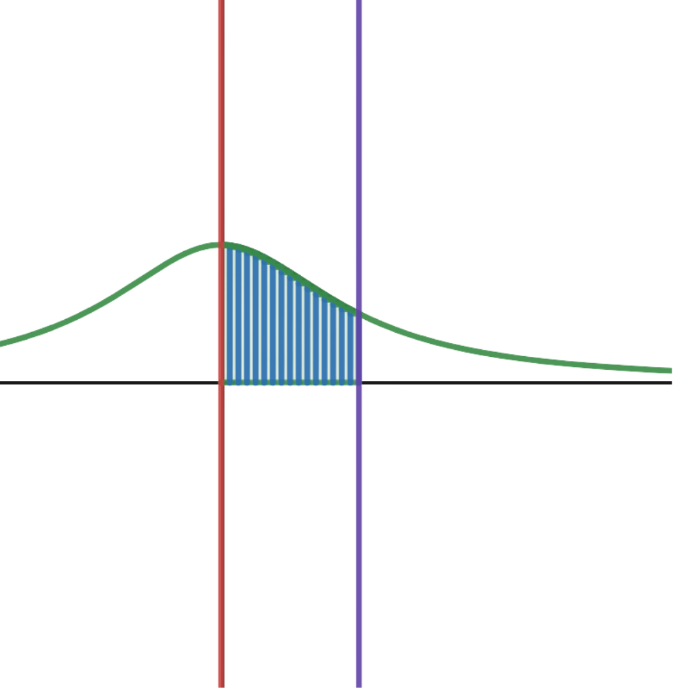
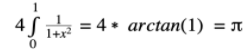

# Proyecto 02

```c++
Pablo Escobar - 20936
Guillermo Santos - 191517
Mariana David - 201055
```

## ```void ejecutar_programa() ```
Para ejecujtar el progama se debe agragar el argumento `-pthread` al compilar.
Posteriormente ejecutar `./main`

## ```int introduccion()```
Este proyecto consiste en obtener una aproximación para el valor de la constante PI utilizando un método de paralelización visto en clase. Esto se logró utilizando la librería pthread, la cuál permite manejar la concurrencia de múltiples procesos y así aprovechar el hardware de las computadoras modernas (Ippolito, 2004). El uso de esta librería fué indispensable dado que para la aproximación fué necesario calcular una suma de Riemann (Imagen 1). Además, fué necesario utilizar una variable mutex para evitar las condiciones de carrera.

<p div align="center" style="text-align:center; width=100px; height=100px">
  
  <br><br>
  <p>Imagen 1. Integral Grafica</p>
  <br><br>
  
  <br><br>
  <p>Ecuacion 1. Integral de arctan(x)</p>

</p>


## ```void referencias() ```
Ippolito Greg. (2004). POSIX Pthreads. https://www.cs.cmu.edu/afs/cs/academic/class/15492-f07/www/pthreads.html
